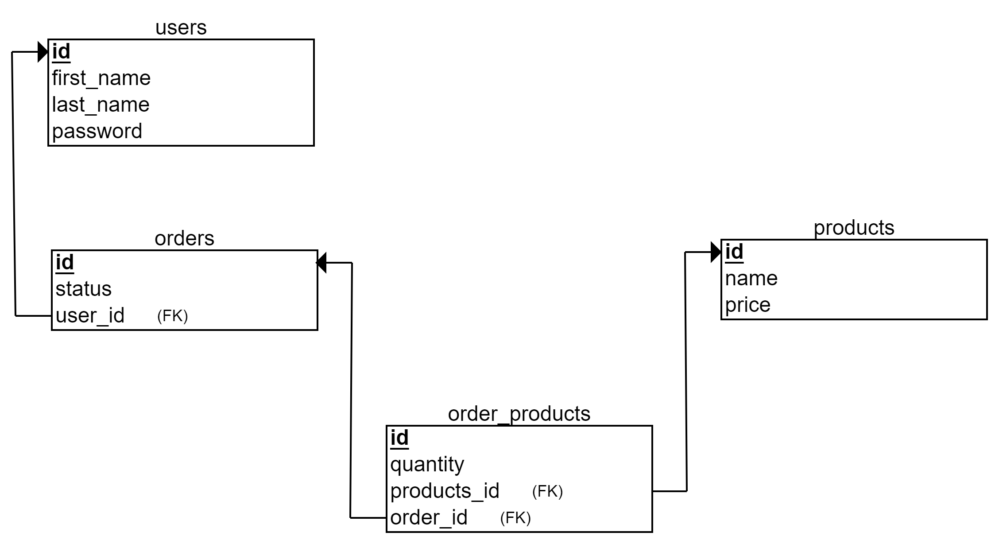

# Storefront-backend-project
### setup steps:

1- install postgres

2- install npm (run: npm install to install packages)

3- run : db-migrate up (to build the used tables on your local machine)

### Server will run on port : 
3000

### database connections:

1- create a database in your machine

2- all the database tables used in this project will be created in your database using
migrations.

3- run migrate up, in order to add tables on your Postgres database.

4- check "database.json" file and change in its values to be suitable with your local machine values for example : 

if you want to run this project using database called "shop" then change :

"database":"store_front_database" to "database" : "shop"

### NOTES:

In order to achieve security, all sensitive information will be stored in the .env file which is hidden,

But because this project is just for practice I will display some of these info here:
### you must change these values with your suitable values.
.env file:

POSTGRES_HOST = localhost

POSTGRES_USER = postgres

POSTGRES_PASSWORD = mark1999

POSTGRES_DB = store_front_database

POSTGRES_DB_TEST = store_front_database_test

ENV = dev

PASS_SALT = 10

PASS_PEPPER = 12345

JWT_KEY = 123

database.json file: // used for migrations

{

    "dev": {
      "driver": "pg",
      "host": "127.0.0.1",
      "database": "store_front_database",
      "user": "postgres",
      "password": "mark1999"
    },
    "test": {
      "driver": "pg",
      "host": "127.0.0.1",
      "database": "store_front_database_test",
      "user": "postgres",
      "password": "mark1999"
    }

# Instruction to access all the endpoints:
### 1- create a user accout (sign up):
using : users/create (post request)
request body = {"first_name":"anyName" , "last_name":"any","password":"anyPass"}
### 2- login with this user account
using url : users/login (post request)
request body = {"id":id , "password":"yourpassword"}

**note : the id is required to login so if you don't know your id you can get it manually from the database.**

**Now you are logged in and can access all the endpoint because you have a JWT token.**
## API Endpoints

### products
1- index : products/index (get request)

2- show : products/show/:id (get request)

3- create : products/create (post request) (body = {"name":"any","price":22}) [token required(log in)]

### users
**you must have a token or logged in to access these endpoints**

1- index : users/index (get request)

2- show : users/show/:id (get request)

3- create : users/create (post request) body = {"first_name":"anyName" , "last_name":"any","password":"anyPass"}

4- login : users/login (post request) body = {"id":id , "password":"yourpassword"}

5- logout : users/logout (get request) (This endpoint will clear the JWT token)

### orders
**you must have a token or logged in to access these endpoints**

1- index : orders/index (get request)

2- show : orders/show/:id (get request)

3- create : orders/create (post request) body = {"user_id":1,"product_id":1,"quantity":1,"status":0}

### services
1- to show orders for a specific user:

url : service/getorders/:user_id (get request)

2- to add product into an order

url : service/add     (post request)(post data will be in body) , body = {order_id:1 , product_id:1,quantity:2}

## Database Schema

### products

id(integer) , name(character varying(100)) , price(character varying(100))

### users

id(integer) , first_name(character varying(100)) , last_name(character varying(100)) , password(character varying(255))

### orders

id(integer), user_id(integer) , status(integer)

### order_products

id(integer) , order_id(integer), product_id(integer), quantity(integer)
